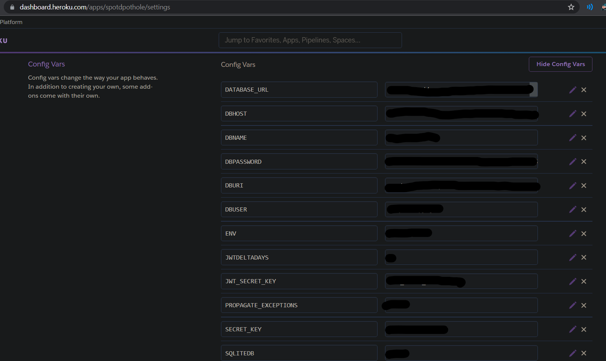

# NULL AND VOID - SpotDPothole Backend
Welcome to our University of the West Indies, Computer Science, Final Year Project! This project aims to provide the backend of an application that is geared towards the logging of potholes located across the roadways of Trinidad and Tobago. This project will be implemented to interface with the corresponding [SpotDPothole Frontend](https://github.com/Boldoosang/NAV-spotDPothole-frontend). Please note that this project reflects the various prototype stages that will be refined over the course of many sprints. Implemented features of the second prototype can be found below.

[](https://github.com/Boldoosang/NAV-spotDPothole-backend/actions/workflows/pytest.yml)

## BACKEND IMPLEMENTED FEATURES
For the second prototype of the application, the following features have been implemented during development:
* Registration and login to application
* Reporting of a pothole via standard interface.
* Reporting of a pothole via driver interface.
* Deletion of the user's own report.
* Updating of a user's report.
* Addition of images to user's report.
* Removal of images to a user's report.
* Viewing of reports of other users.
* Viewing of reported potholes.
* Automatic timeout of potholes that have not been reported.
* Auto moderation of potholes that have received sufficient downvotes.
* Accessing analytical information for potholes.
* Voting on a report of a pothole.
* Generating navigational routes from source to destination, preferring pothole free routes.
* Automatic snapping of reports to roads.
* Dynamic image resizing and compression upon upload.
* Email based account confirmation.
* Password resetting.

## POSTMAN COLLECTIONS
* [SpotDPothole Postman Collections](https://linktr.ee/spotDPothole)

## DEPENDENCIES
* [Python3](https://www.python.org/downloads/) - Python as main programming language.
* [Python3 Modules (requirements.txt)](https://github.com/Boldoosang/NAV-spotDPothole-backend/blob/main/requirements.txt) - Python modules used in the development of the application.
* [Open Source Routing Machine](https://hub.docker.com/r/boldoosang/spotdpothole-osrm) - OSRM server used for snapping reports to roads.

Dependencies can be installed using:
```
$ pip3 install -r requirements.txt
```

## CONFIGURATION
In development, configuration can be handled through the use of a 'config.py' file, with a class of 'development' that will specify the parameters for the flask backend server. This file should make use of the various flask configuration settings in order to confgure the application. Please note that this file is not included in the repository as it contains sensitive information that would be dependent on the application deployment use. However, an example file is provided, 'config.example.py', that will show the required information fields for deployment of the application. In the absense of the 'config.py' file, the configuration will default to the use of the environment variables; which are preset variables of the machine that will be hosting the application.
In production, environment variables should be used as these variables ensure that the sensitive information variables can be loaded as needed without being present into the code.

## HEROKU SETUP
The application can be deployed to heroku using the button below. 

[](https://heroku.com/deploy)

The application must also be configured using the configuration information above. The environment variables for the heroku deployed application can be accessed in the settings of the application, after clicking on "Reveal Config Vars".



## MANAGEMENT
The use of the 'manage.py' file can be used to execute various managerial tasks as well as initiate tests. The command for executing a manage command can be executed as follows, replacing |task| with the task to be carried out: 
```
$ py manage.py |task|
```
* If using gitpod, please swap the keyword 'py' with 'python'.
Please note that custom tasks can also be created by using the '@manager.command' as follows:
```
@manager.command
def task():
    print("Testing Task")
```

Some available useful commands include:
* banUser (email)
* unbanUser (email)
* removePothole (potholeID)
* removeReport (reportID)

## SERVING THE PROJECT
In the development environment, the application can be served using both:
```
$ py manage.py serve
or
$ npm run serve
```
* If using gitpod, please swap the keyword 'py' with 'python'.  
In the production environment, the application is interfaced with gunicorn and can be executed using:
```
$ gunicorn -w 4 "App.main:create_app()"
```

## DATABASE INITIALIZATION
The database can be initialized either of the following commands:
```
$ py manage.py initDB
or
$ npm run initDB
```
* If using gitpod, please swap the keyword 'py' with 'python'.
* Note that if the 'SQLITEDB' configuration variable is set to true, a sqlite database 'spotDPothole.db' will be created.

## DATABASE MIGRATIONS
If the database is modified, it must be migrated to the conform with the new configuration. The following commands facilitate the migration of the database:
```
$ py manage.py db init
$ py manage.py db migrate
$ py manage.py db upgrade
```
* If using gitpod, please swap the keyword 'py' with 'python'.

## TESTING
With the PyTest module installed, the system components can be evaluated using both integration and unit tests using the following command:
```
$ pytest
```
Tests can be modified by navigating to /App/tests and editing the test_application.py file.  
For the purposes of testing, it is highly recommended to use gitpod to ensure a dependable environment for testing.
Be sure to drop the config.py file into the /App directory for use of your custom configuration settings.

[](https://gitpod.io/#https://github.com/Boldoosang/NAV-spotDPothole-backend)


## PROJECT DELIVERABLES
* [SpotDPothole Web Application](https://spotdpoth.web.app/)
* [SpotDPothole OSRM Server](https://hub.docker.com/r/boldoosang/spotdpothole-osrm)
* [Project Report](https://docs.google.com/document/d/1MbG_XzXLCaeWMDBc3Zezz9sAgkBU1_tGtYckHa-LVjU/edit)
* [Trello Board](https://trello.com/b/bCe8RVWj/spotdpothole-board)
* [Presentation Video](https://drive.google.com/file/d/1UykyVaxr4G0CXS1ABVqcTvMwgmhXvOui/view?usp=sharing)
* [Sprint Reports](https://docs.google.com/document/d/1jxIfp3vwikRcj7EJdyDVY7riiU0riKOS5hV0pR2tbb8/edit)
